# SYSTEM_DESIGN.md — NourAI v2

> **NourAI — AI-Powered Unified Healthcare Platform**  
> Technical architecture document for Tatweer Hackathon  
> Current MVP architecture + future production-grade medical platform design

---

## Document Purpose

This document explains the technical architecture of NourAI.

It is written for reviewers, judges, engineers, and future contributors who want to understand:

- what the current MVP is built with;
- how the platform works today;
- how the system can evolve after the hackathon;
- how AI fits into the healthcare workflow;
- how NourAI can scale to rural communities, the UAE, GCC, and beyond;
- how privacy, security, and medical safety are handled.

This document complements:

- [`README.md`](./README.md)
- [`VALIDATION.md`](./VALIDATION.md)
- [`REFERENCES.md`](./REFERENCES.md)

---

# 1. Executive Summary

NourAI is a unified healthcare platform that connects patients, doctors, pharmacies, insurance workflows, telemedicine, AI assistance, and public health insights.

The current MVP is a working web application built with:

- React 18
- Vite 6
- React Router
- TailwindCSS
- Radix UI
- Recharts
- Base44 SDK
- Base44 Entities
- Base44 AI integrations
- Twilio Video component

The future production version is designed as a secure cloud-native healthcare platform using:

- Next.js / React Native
- NestJS + FastAPI
- PostgreSQL
- Redis
- Object Storage
- RAG
- Medical LLM
- FHIR-ready data model
- Kubernetes
- Azure / AWS deployment

The current MVP proves the workflow. The future architecture shows how the platform can become a real medical-grade infrastructure layer.

---

# 2. Architecture Goals

NourAI is designed around the following goals:

| Goal | Description |
|---|---|
| Accessibility | Improve access to healthcare for rural and remote communities |
| Continuity of Care | Keep patient history available across providers |
| AI Assistance | Help organize, summarize, and navigate healthcare information |
| Safety | Keep doctors responsible for diagnosis and treatment |
| Privacy | Protect patient data and use only anonymized analytics |
| Scalability | Grow from one community to national and GCC-level deployment |
| Interoperability | Prepare for future FHIR-compatible healthcare integrations |
| Maintainability | Use modular services and clear separation of concerns |

---

# 3. Current MVP Architecture

## 3.1 Real Technology Stack

The uploaded NourAI MVP uses the following real stack.

### Frontend

- React 18
- Vite 6
- JavaScript / JSX
- React Router DOM v7
- TailwindCSS
- Radix UI
- Lucide React
- Framer Motion
- Recharts
- React Hook Form
- Zod
- Sonner
- Date-fns

### Backend / Platform

- Base44 SDK
- Base44 Authentication
- Base44 Entities
- Base44 Functions
- Base44 Integrations

### AI

- InvokeLLM
- UploadFile
- UploadPrivateFile
- ExtractDataFromUploadedFile
- CreateFileSignedUrl
- TranscribeAudio
- GenerateSpeech
- GenerateImage
- GenerateVideo

### Telemedicine

- Twilio Video component
- Video consultation workflow

### Analytics

- Recharts
- Health summary cards
- Appointment analytics
- Mental health charts
- Vital signs charts

---

# 4. Current MVP Modules

The current project includes the following modules and pages:

| Area | Modules |
|---|---|
| Patient | Profile, medical records, prescriptions, insurance, reminders, mental health |
| Doctor | Dashboard, patients, appointments, prescriptions, doctor profile |
| Admin | Doctor verification, insurance, pharmacies, admin dashboard |
| AI | DrNourChat, AI summaries, document analysis |
| Telemedicine | Video consultation, Twilio video component |
| Pharmacy | Pharmacy list, pharmacy detail, pharmacy orders |
| Analytics | HealthAnalytics, charts, appointment analytics |
| Authentication | Base44 user authentication and role-based flows |

---

# 5. Current MVP High-Level Diagram

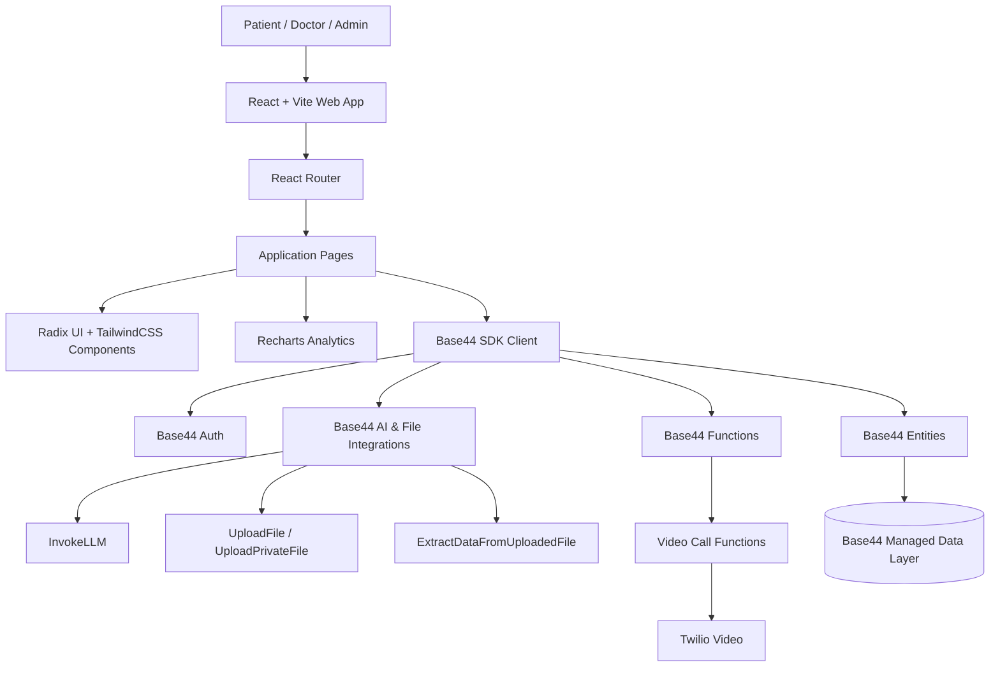

---

# 6. C4 Context Diagram

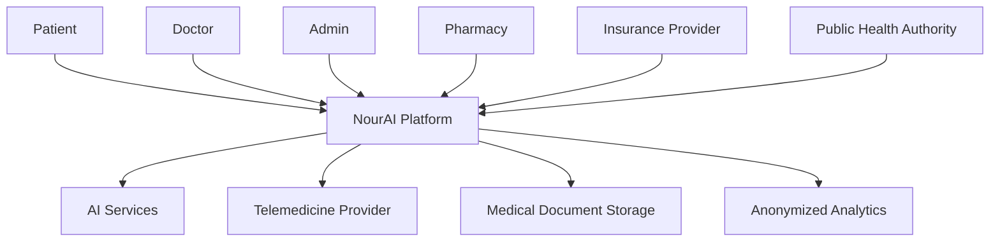

## Explanation

At the highest level, NourAI is a coordination platform between multiple healthcare stakeholders. It does not replace hospitals or doctors. It connects people, records, and workflows.

---

# 7. C4 Container Diagram

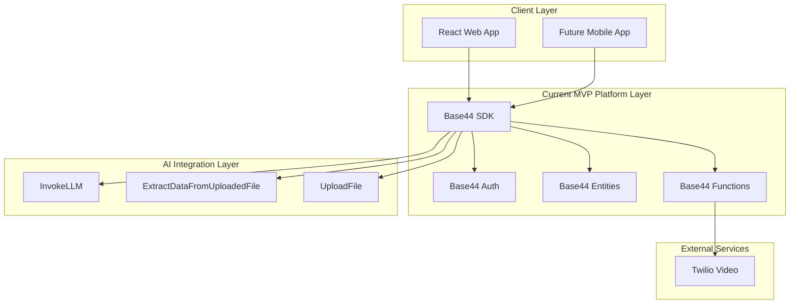

---

# 8. Current MVP Entity Model

The current project uses Base44-managed entities. These are mapped conceptually below.

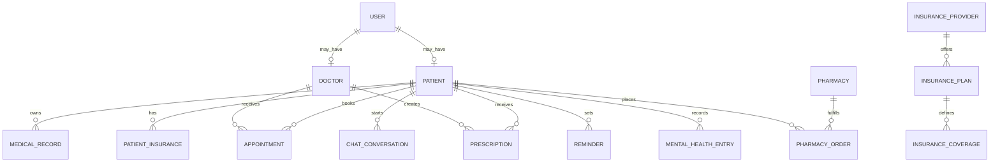

---

# 9. Current MVP User Flow

## 9.1 Patient Journey

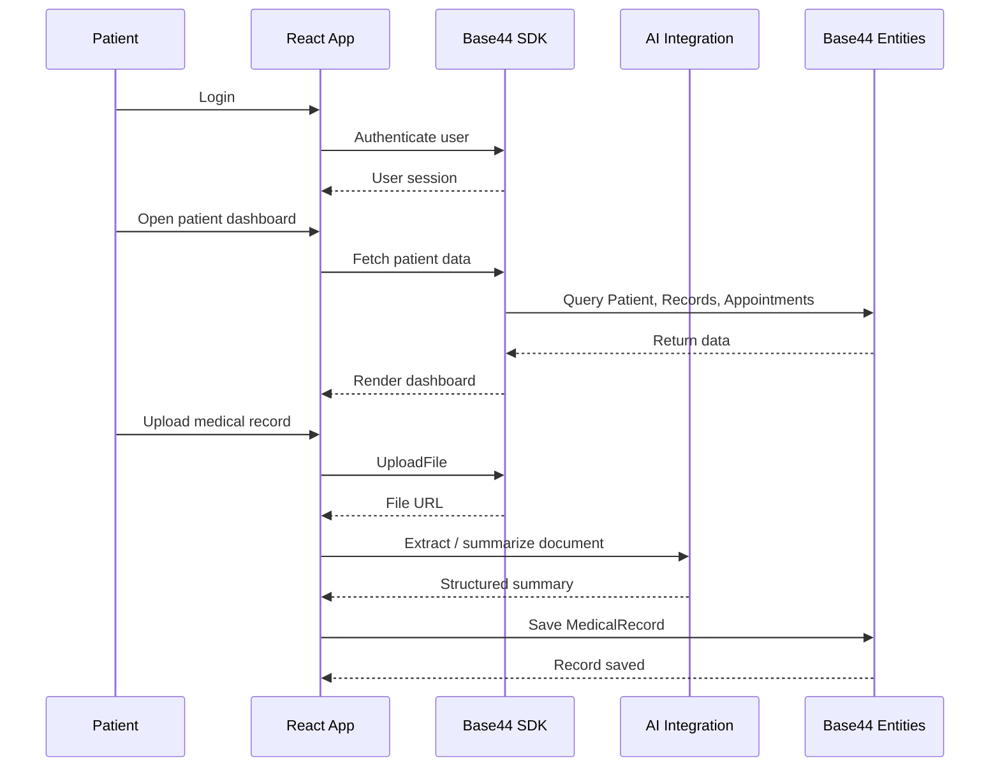

## 9.2 Doctor Journey

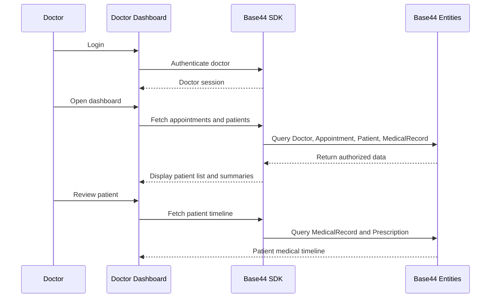

## 9.3 Telemedicine Flow

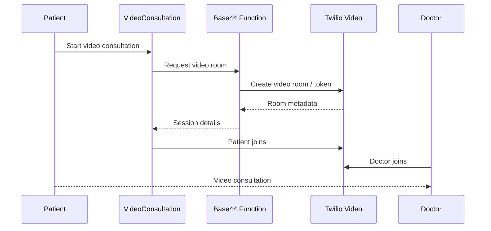

---

# 10. Current MVP Strengths

The current MVP is strong because it demonstrates a real multi-role healthcare workflow.

## Implemented Strengths

- Patient portal exists.
- Doctor dashboard exists.
- Admin dashboard exists.
- AI assistant exists.
- Medical records workflow exists.
- Insurance module exists.
- Pharmacy module exists.
- Prescriptions module exists.
- Telemedicine component exists.
- Analytics components exist.
- Mental health module exists.
- Reminders exist.

This makes the project much stronger than a concept-only submission.

---

# 11. Current MVP Limitations

The current MVP is not yet a medical-grade production system.

## Known MVP Limitations

- It uses Base44 managed backend rather than custom healthcare microservices.
- It does not yet integrate with real hospital systems.
- It does not yet implement FHIR interoperability.
- It uses general-purpose AI integrations, not a dedicated medical LLM.
- It uses synthetic data, not real patient data.
- It is not clinically validated.
- It is not a certified medical device.
- It does not replace licensed doctors.

These limitations are expected for a hackathon MVP and are addressed in the future architecture.

---

# 12. Future Production Architecture

The production version should migrate toward a modular, secure, healthcare-grade architecture.

## Recommended Future Stack

| Layer | Recommended Technology |
|---|---|
| Web Frontend | Next.js + TypeScript |
| Mobile | React Native / Expo |
| Backend Business Services | NestJS |
| AI Services | FastAPI |
| Database | PostgreSQL |
| Vector Search | pgvector / Pinecone |
| Cache | Redis |
| Object Storage | Azure Blob Storage / AWS S3 |
| Queue | Azure Service Bus / AWS SQS / BullMQ |
| Auth | OAuth2 / OpenID Connect / UAE PASS-ready |
| Deployment | Docker + Kubernetes |
| Monitoring | Prometheus + Grafana |
| Logging | OpenTelemetry + Azure Monitor / CloudWatch |
| AI | RAG + Medical LLM |
| Interoperability | FHIR-ready data model |

---

# 13. Future Production Diagram

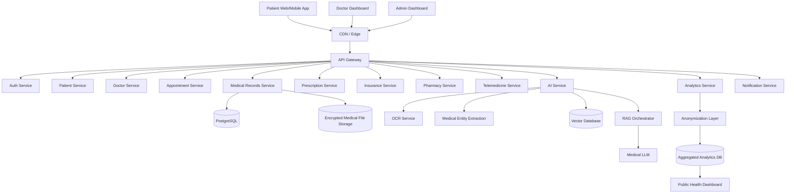

---

# 14. Service Responsibilities

| Service | Responsibility |
|---|---|
| Auth Service | Login, sessions, MFA, role-based access |
| Patient Service | Patient profiles and health overview |
| Doctor Service | Doctor profiles, specialties, verification |
| Appointment Service | Booking and scheduling |
| Medical Records Service | File metadata, record timeline, document access |
| AI Service | LLM, RAG, summaries, extraction |
| Telemedicine Service | Video consultation sessions |
| Prescription Service | E-prescriptions and medication history |
| Insurance Service | Insurance providers, plans, coverage |
| Pharmacy Service | Pharmacy orders and fulfillment |
| Analytics Service | Aggregated public health insights |
| Notification Service | Reminders, alerts, follow-ups |

---

# 15. AI Architecture

## 15.1 Current MVP AI

The MVP uses Base44 AI capabilities:

- InvokeLLM
- UploadFile
- ExtractDataFromUploadedFile
- DrNourChat
- AI-supported document understanding
- AI-supported summaries

## 15.2 Future Medical AI Architecture

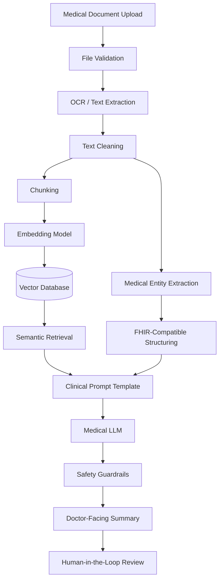

---

# 16. RAG Pipeline

RAG stands for Retrieval-Augmented Generation.

Instead of asking the AI to answer from memory, NourAI retrieves relevant patient records and gives them as grounded context.

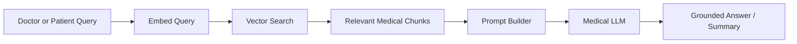

## Why RAG Matters

RAG reduces hallucination by grounding the response in patient-specific medical documents.

---

# 17. Future Medical LLM

Future NourAI will train or fine-tune a domain-specific medical language model.

## Model Goals

- Summarize patient history.
- Extract medications.
- Extract allergies.
- Extract diagnoses.
- Extract lab values.
- Support Arabic and English.
- Generate doctor-facing summaries.
- Improve patient preparation before consultation.

## Model Boundary

The model must not:

- replace doctors;
- issue autonomous diagnosis;
- prescribe medication independently;
- override licensed healthcare professionals.

The model should:

- summarize;
- organize;
- retrieve;
- explain;
- assist;
- prepare.

---

# 18. Mathematical Models

This section describes mathematical foundations for the future AI layer.

## 18.1 Embeddings

Each medical document chunk can be represented as a vector:

```text
f(d_i) = v_i ∈ R^n
```

Where:

- `d_i` = document chunk
- `v_i` = vector embedding
- `R^n` = n-dimensional semantic space

## 18.2 Cosine Similarity

Semantic search uses cosine similarity:

```text
cos(q, d) = (q · d) / (||q|| ||d||)
```

Where:

- `q` = query vector
- `d` = document vector

Higher score means higher semantic relevance.

## 18.3 RAG Formula

```text
Answer = LLM(Query, TopK(Retrieve(Query, Records)))
```

Where:

- `TopK` = top relevant medical chunks
- `Records` = patient medical records
- `LLM` = medical language model

## 18.4 Transformer Attention

```text
Attention(Q, K, V) = softmax((QKᵀ) / sqrt(d_k))V
```

This allows the model to focus on relevant parts of medical context.

## 18.5 Risk Prioritization Score

Future non-diagnostic prioritization:

```text
RiskScore = σ(w₁x₁ + w₂x₂ + ... + wₙxₙ + b)
```

Where:

- `x_i` = features such as age, vitals, labs, chronic conditions
- `w_i` = learned weights
- `σ` = sigmoid function

This should be used for prioritization only, not diagnosis.

## 18.6 Public Health Incidence Rate

```text
IncidenceRate = NewCases / PopulationAtRisk
```

Used for anonymized public health trends.

---

# 19. FHIR-Ready Medical Data Model

Future production should map NourAI entities to FHIR resources.

| NourAI Entity | FHIR Resource |
|---|---|
| Patient | Patient |
| Doctor | Practitioner |
| Appointment | Appointment |
| Medical Record | DocumentReference |
| Lab Result | Observation |
| Diagnosis | Condition |
| Prescription | MedicationRequest |
| Insurance | Coverage |
| Allergy | AllergyIntolerance |
| Emergency Summary | Composition |

FHIR readiness improves future interoperability with healthcare providers.

---

# 20. Future Database ERD

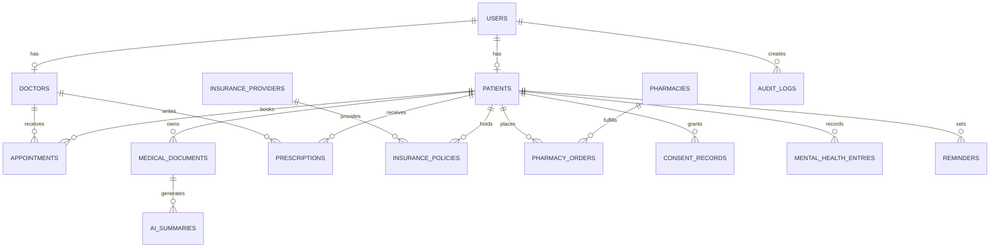

---

# 21. API Architecture

Future production APIs.

## Authentication

```text
POST /auth/login
POST /auth/logout
POST /auth/refresh
GET  /auth/me
```

## Patients

```text
GET    /patients/{id}
PATCH  /patients/{id}
GET    /patients/{id}/timeline
GET    /patients/{id}/emergency-summary
```

## Doctors

```text
GET   /doctors
GET   /doctors/{id}
POST  /doctors/register
PATCH /doctors/{id}/verify
```

## Medical Records

```text
POST /records/upload
GET  /records/{id}
GET  /patients/{id}/records
POST /records/{id}/analyze
```

## AI

```text
POST /ai/chat
POST /ai/summarize-record
POST /ai/generate-emergency-summary
POST /ai/extract-medical-entities
```

## Appointments

```text
POST  /appointments
GET   /appointments/{id}
PATCH /appointments/{id}
```

## Public Health Analytics

```text
GET /analytics/aggregated
GET /analytics/chronic-disease-trends
GET /analytics/regional-demand
```

---

# 22. Security Architecture

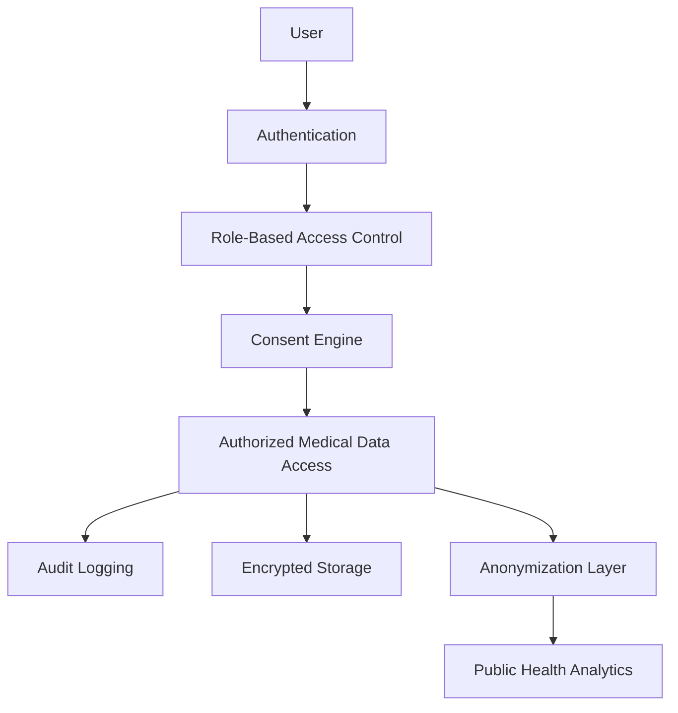

## Security Controls

- HTTPS / TLS
- encryption at rest
- role-based access control
- multi-factor authentication readiness
- audit logs
- patient consent records
- signed URLs for private documents
- secret management
- anonymization before analytics
- synthetic data for demo

---

# 23. Privacy Model

NourAI follows privacy-by-design principles.

## Principles

1. Patients control access to their records.
2. Doctors see only authorized patient data.
3. Public health dashboards use anonymized aggregation.
4. Demo data is synthetic.
5. Medical access is auditable.
6. Personally identifiable information is never exposed in analytics.

## Consent Model

A future `ConsentRecord` should include:

```text
patient_id
authorized_party_id
scope
purpose
expiration_date
created_at
revoked_at
```

---

# 24. Public Health Analytics Pipeline

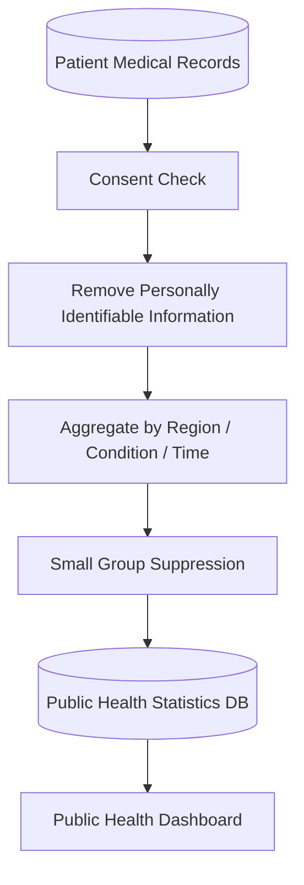

## Possible Metrics

- chronic disease prevalence;
- appointment demand;
- medication demand;
- mental health demand;
- regional healthcare needs;
- preventive care indicators.

---

# 25. Queue-Based AI Processing

Large medical file processing should be asynchronous.

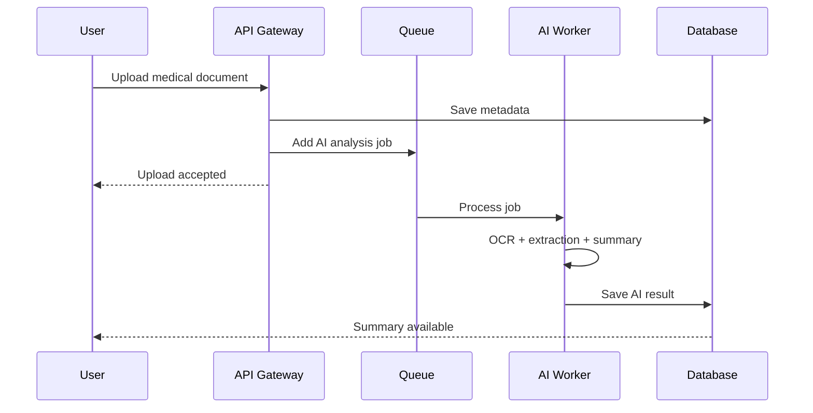

Recommended tools:

- Redis Queue
- Celery
- BullMQ
- Azure Service Bus
- AWS SQS

---

# 26. Deployment Architecture

## Current MVP Deployment

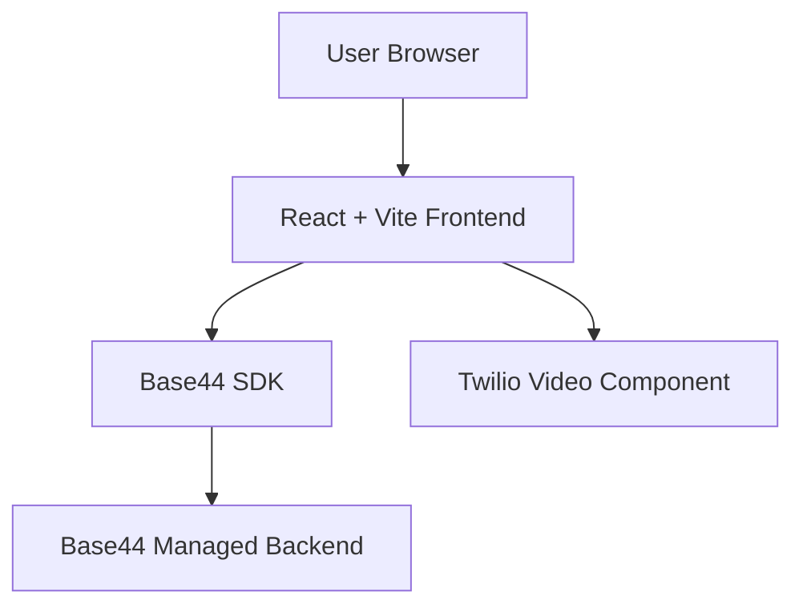

## Future Production Deployment

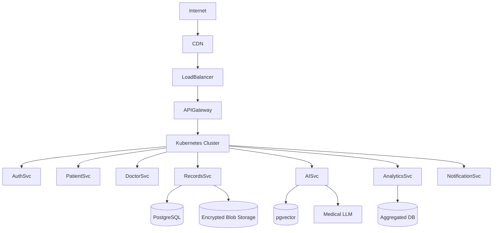

---

# 27. Scalability Strategy

## Current MVP

Base44 allows rapid MVP delivery and managed backend functionality.

## Future Scale

Future NourAI should support:

- horizontal scaling;
- stateless backend services;
- independent AI workers;
- queue-based processing;
- read replicas;
- CDN delivery;
- regional deployment;
- separate analytics database.

---

# 28. Monitoring and Observability

Recommended production monitoring:

- API latency;
- frontend errors;
- authentication failures;
- AI processing time;
- failed document extraction;
- video consultation reliability;
- database performance;
- storage usage;
- suspicious access patterns.

Recommended tools:

- Prometheus
- Grafana
- Sentry
- OpenTelemetry
- Azure Monitor
- AWS CloudWatch

---

# 29. CI/CD Pipeline

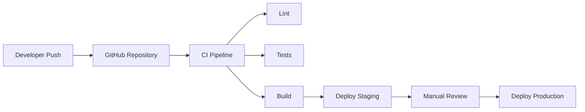

Recommended checks:

- linting;
- unit tests;
- build verification;
- dependency audit;
- security scan;
- environment validation.

---

# 30. Disaster Recovery

Recommended disaster recovery plan:

- encrypted backups;
- point-in-time database restore;
- object storage versioning;
- infrastructure as code;
- multi-zone deployment;
- tested restore procedures.

Suggested targets:

```text
MVP RPO: 24 hours
MVP RTO: 4–8 hours

Production RPO: less than 1 hour
Production RTO: less than 2 hours
```

---

# 31. Design Decisions

## Why React + Vite for MVP?

Fast development, strong ecosystem, and simple deployment.

## Why Base44 for MVP?

Base44 enables rapid backend, authentication, entities, functions, and AI integration for hackathon development.

## Why Twilio for video?

Twilio provides reliable programmable video infrastructure.

## Why Recharts?

Recharts enables fast dashboard and analytics visualization inside React.

## Why PostgreSQL for future production?

PostgreSQL is reliable, mature, and suitable for structured healthcare data.

## Why pgvector?

It allows vector search inside PostgreSQL, reducing architecture complexity.

## Why RAG?

RAG grounds AI outputs in patient-specific medical records and reduces hallucination risk.

## Why a Medical LLM?

A domain-specific model can better understand medical language than a general-purpose model.

## Why FHIR-ready design?

FHIR improves future healthcare interoperability.

---

# 32. How This Supports Tatweer Criteria

| Tatweer Criterion | Architecture Support |
|---|---|
| Impact | Supports patients, doctors, pharmacies, insurers, and public health |
| Relevance | Designed for remote communities such as Al Qua'a |
| Feasibility | Current MVP uses working web stack and managed backend |
| Readiness | Existing project includes real pages and workflows |
| Scalability | Future architecture supports national expansion |
| Evidence | Features are testable through demo and validation document |
| Documentation | Architecture, validation, references, and README are separated clearly |

---

# 33. Conclusion

The current NourAI MVP is a real React + Vite + Base44 healthcare web application with:

- patient portal;
- doctor dashboard;
- admin dashboard;
- AI assistant;
- medical records;
- prescriptions;
- insurance;
- pharmacy;
- telemedicine;
- mental health;
- reminders;
- analytics.

The future production architecture evolves this MVP into a secure, scalable, interoperable, AI-assisted healthcare infrastructure platform.

NourAI is not positioned as a replacement for doctors.

It is a digital healthcare coordination layer that helps patients access care, helps doctors review history faster, and helps healthcare systems plan using anonymized evidence.

